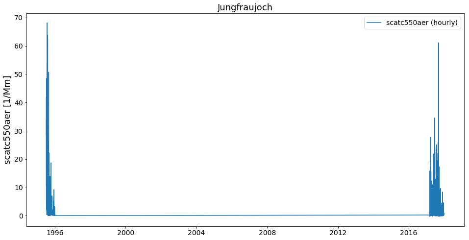
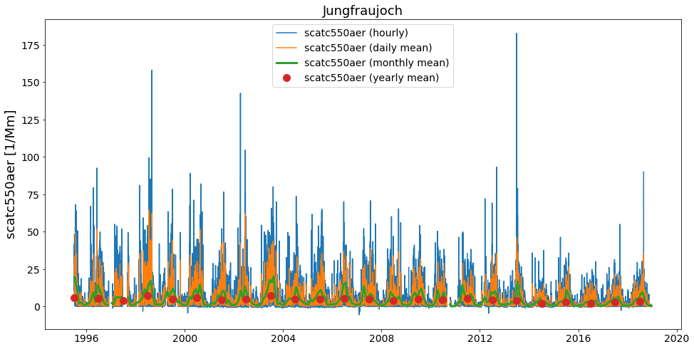
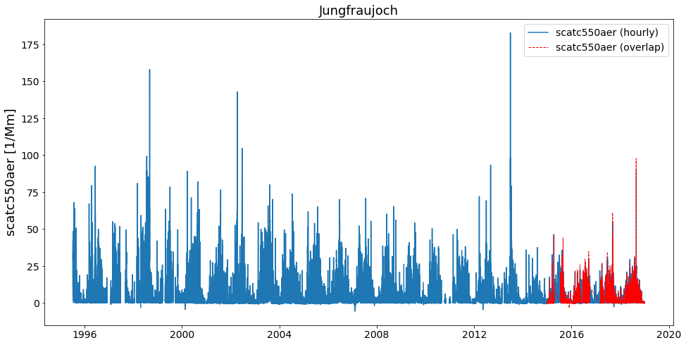
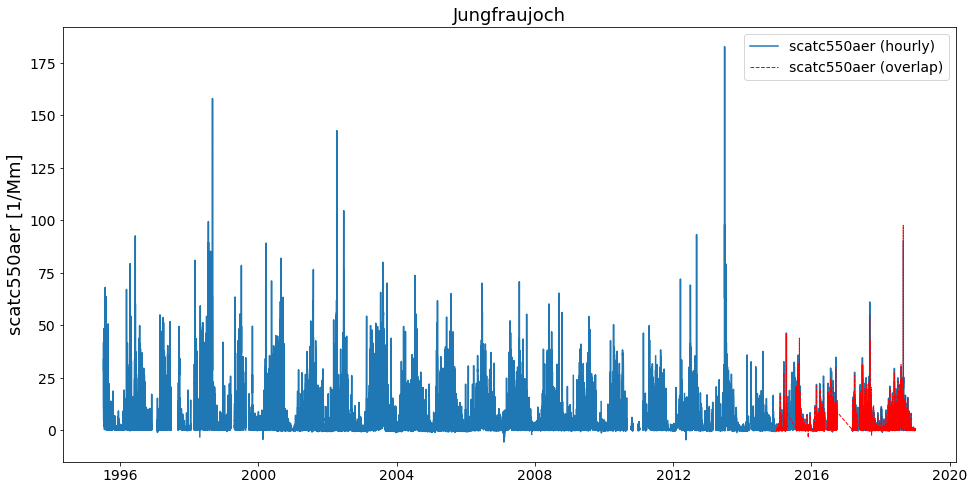
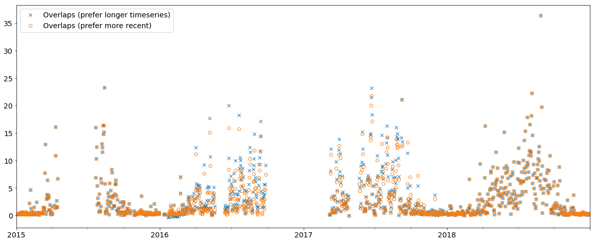
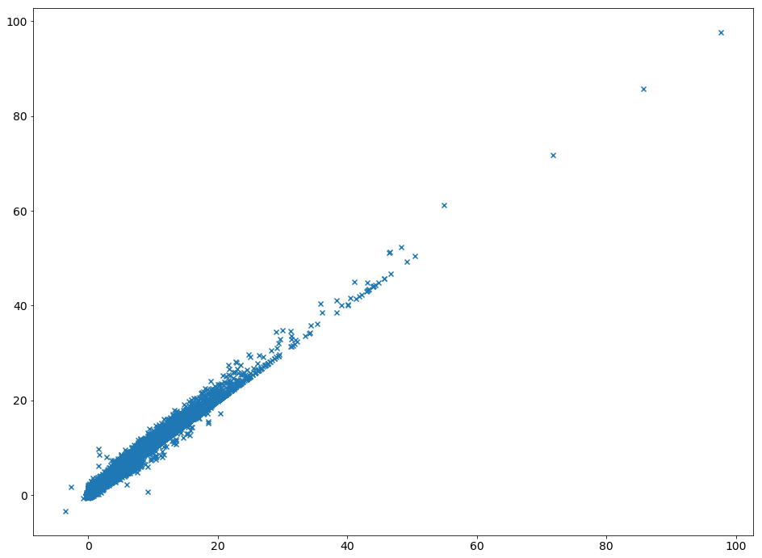

Merging of several StationData objects into one
~~~~~~~~~~~~~~~~~~~~~~~~~~~~~~~~~~~~~~~~~~~~~~~

This notebook illustrates how one can merge several instances
StationData objects into one objects. This merging only works for data
from the same station and a typical case is if the data source files for
one station are separated into many single files containing only parts
of the data (e.g. if the files contain only one year of data).

In the following, the example of the EBAS database is used for
illustration. In particular, we will focus on the retrieval of the
aerosol light scattering coefficients at 550 nm (**scatc550aer** in
AEROCOM naming convention) for the station **Jungfraujoch**, located in
Germany.

.. code:: ipython3

    import pyaerocom as pya

.. parsed-literal::

    Initating pyaerocom configuration
    Checking database access...
    Checking access to: /lustre/storeA
    Access to lustre database: True
    Init data paths for lustre
    Expired time: 0.022 s

Get list of all files containing scattering data for EBAS station Jungfraujoch
^^^^^^^^^^^^^^^^^^^^^^^^^^^^^^^^^^^^^^^^^^^^^^^^^^^^^^^^^^^^^^^^^^^^^^^^^^^^^^

.. code:: ipython3

    reader = pya.io.ReadEbas()
    data = reader.read(vars_to_retrieve='scatc550aer', 
                                datalevel=2, station_names='Jungfraujoch')
    print(data)

.. parsed-literal::

    Reading files 1-3 of 28 (ReadEbas) | 14:21:46 (delta = 0 s')
    Reading files 3-5 of 28 (ReadEbas) | 14:21:47 (delta = 0 s')
    Reading files 5-7 of 28 (ReadEbas) | 14:21:47 (delta = 0 s')
    Reading files 7-9 of 28 (ReadEbas) | 14:21:48 (delta = 0 s')
    Reading files 9-11 of 28 (ReadEbas) | 14:21:48 (delta = 0 s')
    Reading files 11-13 of 28 (ReadEbas) | 14:21:49 (delta = 0 s')
    Reading files 13-15 of 28 (ReadEbas) | 14:21:50 (delta = 0 s')
    Reading files 15-17 of 28 (ReadEbas) | 14:21:51 (delta = 0 s')
    Reading files 17-19 of 28 (ReadEbas) | 14:21:52 (delta = 1 s')
    Reading files 19-21 of 28 (ReadEbas) | 14:21:53 (delta = 0 s')
    Reading files 21-23 of 28 (ReadEbas) | 14:21:54 (delta = 0 s')
    Reading files 23-25 of 28 (ReadEbas) | 14:21:55 (delta = 1 s')
    Reading files 25-27 of 28 (ReadEbas) | 14:21:58 (delta = 2 s')
    Reading files 27-29 of 28 (ReadEbas) | 14:22:00 (delta = 1 s')

.. parsed-literal::

    
    Pyaerocom UngriddedData
    -----------------------
    Contains networks: ['EBASMC']
    Contains variables: ['scatc550aer']
    Contains instruments: ['IN3563', 'TSI_3563_JFJ_dry', 'Ecotech_Aurora3000_JFJ_dry']
    Total no. of meta-blocks: 28
    Filters that were applied:
     Filter time log: 20190603142146
    	prefer_statistics: ['arithmetic mean', 'median']
    	wavelength_tol_nm: 50
    	remove_invalid_flags: True
    	remove_outliers: False
    	keep_aux_vars: False
    	datalevel: 2
    	station_names: Jungfraujoch

As you can see, the data has successfully been imported into an instance
of the ``UngriddedData`` class. This class is organised *by file*, that
is, for each of the 26 files that were imported, there is one metadata
dictionary assigned. Let’s look at the metadata from the first file:

.. code:: ipython3

    data.metadata[0]

.. parsed-literal::

    OrderedDict([('latitude', 46.5475),
                 ('longitude', 7.985),
                 ('altitude', 3578.0),
                 ('station_name', 'Jungfraujoch'),
                 ('instrument_name', 'IN3563'),
                 ('PI', 'Baltensperger, Urs; Weingartner, Ernest'),
                 ('ts_type', 'hourly'),
                 ('data_id', 'EBASMC'),
                 ('revision_date', numpy.datetime64('2018-10-31T00:00:00')),
                 ('datalevel', '2'),
                 ('filename',
                  'CH0001G.19950101000000.20181031145000.nephelometer..aerosol.1y.1h.CH02L_IN3563.CH02L_backscat_coef.lev2.nas'),
                 ('var_info',
                  OrderedDict([('scatc550aer',
                                {'name': 'aerosol_light_scattering_coefficient',
                                 'units': '1/Mm',
                                 'wavelength': '550.0 nm',
                                 'method_ref': 'CH02L_scat_coef',
                                 'matrix': 'aerosol',
                                 'statistics': 'arithmetic mean'})])),
                 ('variables', ['scatc550aer'])])

And the last one:

.. code:: ipython3

    data.metadata[25]

.. parsed-literal::

    OrderedDict([('latitude', 46.5475),
                 ('longitude', 7.985),
                 ('altitude', 3580.0),
                 ('station_name', 'Jungfraujoch'),
                 ('instrument_name', 'Ecotech_Aurora3000_JFJ_dry'),
                 ('PI', 'Bukowiecki, Nicolas; Baltensperger, Urs'),
                 ('ts_type', 'hourly'),
                 ('data_id', 'EBASMC'),
                 ('revision_date', numpy.datetime64('2019-05-24T00:00:00')),
                 ('datalevel', '2'),
                 ('filename',
                  'CH0001G.20170101000000.20190524143212.nephelometer..aerosol.1y.1h.CH02L_Ecotech_Aurora3000_JFJ_dry.CH02L_Neph_Aurora3000.lev2.nas'),
                 ('var_info',
                  OrderedDict([('scatc550aer',
                                {'name': 'aerosol_light_scattering_coefficient',
                                 'units': '1/Mm',
                                 'wavelength': '525.0 nm',
                                 'statistics': 'arithmetic mean',
                                 'matrix': 'aerosol'})])),
                 ('variables', ['scatc550aer'])])

As you can see, both files contain scattering data but do not share all
the same metadata attributes (e.g. ``instrument_name`` is different,
which might be due to technological updates over time).

Let’s have a look at the respective time-series for both stations.
First, convert into instance of ``StationData`` class and then plot.

.. code:: ipython3

    first_file = data.to_station_data(0, vars_to_convert='scatc550aer')
    print(first_file)

.. parsed-literal::

    
    Pyaerocom StationData
    ---------------------
    var_info (BrowseDict):
      scatc550aer (dict):
        name: aerosol_light_scattering_coefficient
        units: 1/Mm
        wavelength: 550.0 nm
        method_ref: CH02L_scat_coef
        matrix: aerosol
        statistics: arithmetic mean
        overlap: False
    station_coords (dict):
      latitude: 46.5475
      longitude: 7.985
      altitude: 3578.0
    data_err (BrowseDict):
      scatc550aer (ndarray, 8760 items): [nan, nan, ..., nan, nan]
    overlap (BrowseDict): <empty_dict>
    filename: CH0001G.19950101000000.20181031145000.nephelometer..aerosol.1y.1h.CH02L_IN3563.CH02L_backscat_coef.lev2.nas
    station_id: None
    station_name: Jungfraujoch
    instrument_name: IN3563
    PI: Baltensperger, Urs; Weingartner, Ernest
    country: None
    ts_type: hourly
    latitude: 46.5475
    longitude: 7.985
    altitude: 3578.0
    data_id: EBASMC
    dataset_name: None
    data_product: None
    data_version: None
    data_level: None
    revision_date: 2018-10-31T00:00:00
    ts_type_src: hourly
    stat_merge_pref_attr: None
    data_revision: 20190530
    
    Data arrays
    .................
    dtime (ndarray, 8760 items): [1995-01-01T00:30:00.000000000, 1995-01-01T01:29:59.000000000, ..., 1995-12-31T22:29:59.000000000, 1995-12-31T23:29:59.000000000]
    Pandas Series
    .................
    scatc550aer (Series, 8760 items)

.. code:: ipython3

    last_file = data.to_station_data(25)
    print(last_file)

.. parsed-literal::

    
    Pyaerocom StationData
    ---------------------
    var_info (BrowseDict):
      scatc550aer (dict):
        name: aerosol_light_scattering_coefficient
        units: 1/Mm
        wavelength: 525.0 nm
        statistics: arithmetic mean
        matrix: aerosol
        overlap: False
    station_coords (dict):
      latitude: 46.5475
      longitude: 7.985
      altitude: 3580.0
    data_err (BrowseDict):
      scatc550aer (ndarray, 8760 items): [nan, nan, ..., nan, nan]
    overlap (BrowseDict): <empty_dict>
    filename: CH0001G.20170101000000.20190524143212.nephelometer..aerosol.1y.1h.CH02L_Ecotech_Aurora3000_JFJ_dry.CH02L_Neph_Aurora3000.lev2.nas
    station_id: None
    station_name: Jungfraujoch
    instrument_name: Ecotech_Aurora3000_JFJ_dry
    PI: Bukowiecki, Nicolas; Baltensperger, Urs
    country: None
    ts_type: hourly
    latitude: 46.5475
    longitude: 7.985
    altitude: 3580.0
    data_id: EBASMC
    dataset_name: None
    data_product: None
    data_version: None
    data_level: None
    revision_date: 2019-05-24T00:00:00
    ts_type_src: hourly
    stat_merge_pref_attr: None
    data_revision: 20190530
    
    Data arrays
    .................
    dtime (ndarray, 8760 items): [2017-01-01T00:30:00.000000000, 2017-01-01T01:29:59.000000000, ..., 2017-12-31T22:29:59.000000000, 2017-12-31T23:29:59.000000000]
    Pandas Series
    .................
    scatc550aer (Series, 8760 items)

.. code:: ipython3

    first_file.plot_timeseries('scatc550aer');

.. image:: add04_stationdata_merging/add04_stationdata_merging_11_0.png

.. code:: ipython3

    last_file.plot_timeseries('scatc550aer');

.. image:: add04_stationdata_merging/add04_stationdata_merging_12_0.png

As you can see, the files contain data from different years. Now, how
can we get these objects into one object that contains the timeseries of
both files from this station?

This is actually very easy:

.. code:: ipython3

    merged = first_file.merge_other(last_file, 'scatc550aer')
    print(merged)

.. parsed-literal::

    
    Pyaerocom StationData
    ---------------------
    var_info (BrowseDict):
      scatc550aer (dict):
        name: aerosol_light_scattering_coefficient
        units: 1/Mm
        wavelength: 550.0 nm;525.0 nm
        method_ref: CH02L_scat_coef
        matrix: aerosol
        statistics: arithmetic mean
        overlap: False
        ts_type: hourly
    station_coords (dict):
      latitude: 46.5475
      longitude: 7.985
      altitude: 3578.0
    data_err (BrowseDict):
      scatc550aer (ndarray, 8760 items): [nan, nan, ..., nan, nan]
    overlap (BrowseDict): <empty_dict>
    filename: CH0001G.19950101000000.20181031145000.nephelometer..aerosol.1y.1h.CH02L_IN3563.CH02L_backscat_coef.lev2.nas; CH0001G.20170101000000.20190524143212.nephelometer..aerosol.1y.1h.CH02L_Ecotech_Aurora3000_JFJ_dry.CH02L_Neph_Aurora3000.lev2.nas
    station_id: None
    station_name: Jungfraujoch
    instrument_name: IN3563; Ecotech_Aurora3000_JFJ_dry
    PI: Baltensperger, Urs; Weingartner, Ernest; Bukowiecki, Nicolas
    country: None
    ts_type: hourly
    latitude: 46.5475
    longitude: 7.985
    altitude: 3578.0
    data_id: EBASMC
    dataset_name: None
    data_product: None
    data_version: None
    data_level: None
    revision_date (list, 2 items): [numpy.datetime64('2018-10-31T00:00:00'), numpy.datetime64('2019-05-24T00:00:00')]
    ts_type_src: hourly
    stat_merge_pref_attr: None
    data_revision: 20190530
    
    Data arrays
    .................
    dtime (ndarray, 9794 items): [1995-07-08T23:00:00.000000000, 1995-07-09T00:00:00.000000000, ..., 2017-12-24T19:00:00.000000000, 2017-12-31T23:00:00.000000000]
    Pandas Series
    .................
    scatc550aer (Series, 9794 items)

As you can see in the output, the merging comprises not only the data
arrays but also registers any differences in the assoicated metdadata
(cf. e.g., sampling wavelength 550 nm vs. 525 nm, instrument name, PI)

Now, have a look at the merged timeseries data.

.. code:: ipython3

    merged.plot_timeseries('scatc550aer');

Looks okay. Let’s merge all 26 files and see if we get a nice long time
series.

Retrieve list of ``StationData`` objects:

.. code:: ipython3

    stats = data.to_station_data('Jungfraujoch', 'scatc550aer', merge_if_multi=False)
    print('Number of StationData objects retrieved: {}'.format(len(stats)))

.. parsed-literal::

    Number of StationData objects retrieved: 28

Now merge them into one long time series:

.. code:: ipython3

    merged = pya.helpers.merge_station_data(stats, var_name='scatc550aer')
    print(merged)

.. parsed-literal::

    
    Pyaerocom StationData
    ---------------------
    var_info (BrowseDict):
      scatc550aer (dict):
        name: aerosol_light_scattering_coefficient
        units: 1/Mm
        wavelength: 550.0 nm;525.0 nm
        statistics: arithmetic mean
        matrix: aerosol
        overlap: False
        ts_type: hourly
        method_ref: CH02L_scat_coef
    station_coords (dict):
      latitude: 46.5475
      longitude: 7.985
      altitude: 3580.0
    data_err (BrowseDict):
      scatc550aer (ndarray, 8760 items): [nan, nan, ..., nan, nan]
    overlap (BrowseDict):
      scatc550aer: 2015-01-01 00:00:00    0.068376
    2015-01-01 01:00:00    0.255198
    2015-01-01 02:00:00   -0.284809
    2015-01-01 03:00:00    0.123830
    2015-01-01 04:00:00    0.127599
    2015-01-01 05:00:00    0.052224
    2015-01-01 06:00:00   -0.011306
    2015-01-01 07:00:00    0.086143
    2015-01-01 08:00:00   -0.088835
    2015-01-01 09:00:00   -0.084528
    2015-01-01 10:00:00    0.082912
    2015-01-01 11:00:00    0.540007
    2015-01-01 12:00:00    0.062992
    2015-01-01 13:00:00    0.791436
    2015-01-01 14:00:00    0.220202
    2015-01-01 15:00:00   -0.008076
    2015-01-01 16:00:00    0.062992
    2015-01-01 17:00:00    0.386565
    2015-01-01 18:00:00    0.272965
    2015-01-01 19:00:00    0.078067
    2015-01-01 20:00:00    0.375259
    2015-01-01 21:00:00    0.059223
    2015-01-01 22:00:00    0.164209
    2015-01-01 23:00:00   -0.025843
    2015-01-02 00:00:00    0.074836
    2015-01-02 01:00:00    0.159902
    2015-01-02 02:00:00    0.003769
    2015-01-02 03:00:00    0.050070
    2015-01-02 04:00:00    0.156134
    2015-01-02 05:00:00   -0.015613
                             ...   
    2018-12-30 18:00:00    0.220902
    2018-12-30 19:00:00   -0.036126
    2018-12-30 20:00:00   -0.193660
    2018-12-30 21:00:00    0.110747
    2018-12-30 22:00:00    0.239261
    2018-12-30 23:00:00    0.108970
    2018-12-31 00:00:00    0.031980
    2018-12-31 01:00:00    0.011845
    2018-12-31 02:00:00    0.090019
    2018-12-31 03:00:00    0.087058
    2018-12-31 04:00:00   -0.119038
    2018-12-31 05:00:00    0.210834
    2018-12-31 06:00:00    0.207281
    2018-12-31 07:00:00    0.154572
    2018-12-31 08:00:00   -0.097126
    2018-12-31 09:00:00    0.187145
    2018-12-31 10:00:00    0.045602
    2018-12-31 11:00:00    0.344086
    2018-12-31 12:00:00    0.145689
    2018-12-31 13:00:00    0.263543
    2018-12-31 14:00:00    0.479707
    2018-12-31 15:00:00    0.099495
    2018-12-31 16:00:00    0.281310
    2018-12-31 17:00:00    0.210834
    2018-12-31 18:00:00    0.395018
    2018-12-31 19:00:00   -0.030204
    2018-12-31 20:00:00    0.625988
    2018-12-31 21:00:00    0.178854
    2018-12-31 22:00:00    0.175893
    2018-12-31 23:00:00    0.329280
    Length: 25789, dtype: float64
    filename: CH0001G.20010101000000.20190524142901.nephelometer..aerosol.1y.1h.CH02L_TSI_3563_JFJ_dry.CH02L_Neph_3563.lev2.nas; CH0001G.20060101000000.20190524142901.nephelometer..aerosol.1y.1h.CH02L_TSI_3563_JFJ_dry.CH02L_Neph_3563.lev2.nas; CH0001G.20180101000000.20190520125514.nephelometer..aerosol.1y.1h.CH02L_Ecotech_Aurora3000_JFJ_dry.CH02L_Neph_Aurora3000.lev2.nas; CH0001G.20040101000000.20190524142901.nephelometer..aerosol.1y.1h.CH02L_TSI_3563_JFJ_dry.CH02L_Neph_3563.lev2.nas; CH0001G.20180101000000.20190520124723.nephelometer..aerosol.1y.1h.CH02L_TSI_3563_JFJ_dry.CH02L_Neph_3563.lev2.nas; CH0001G.20080101000000.20190524142901.nephelometer..aerosol.1y.1h.CH02L_TSI_3563_JFJ_dry.CH02L_Neph_3563.lev2.nas; CH0001G.20050101000000.20190524142901.nephelometer..aerosol.1y.1h.CH02L_TSI_3563_JFJ_dry.CH02L_Neph_3563.lev2.nas; CH0001G.20070101000000.20190524142901.nephelometer..aerosol.1y.1h.CH02L_TSI_3563_JFJ_dry.CH02L_Neph_3563.lev2.nas; CH0001G.20030101000000.20190524142901.nephelometer..aerosol.1y.1h.CH02L_TSI_3563_JFJ_dry.CH02L_Neph_3563.lev2.nas; CH0001G.20150101000000.20190524143212.nephelometer..aerosol.1y.1h.CH02L_Ecotech_Aurora3000_JFJ_dry.CH02L_Neph_Aurora3000.lev2.nas; CH0001G.20170101000000.20190524142901.nephelometer..aerosol.1y.1h.CH02L_TSI_3563_JFJ_dry.CH02L_Neph_3563.lev2.nas; CH0001G.20160101000000.20190524142901.nephelometer..aerosol.1y.1h.CH02L_TSI_3563_JFJ_dry.CH02L_Neph_3563.lev2.nas; CH0001G.20000101000000.20181031145000.nephelometer..aerosol.1y.1h.CH02L_IN3563.CH02L_backscat_coef.lev2.nas; CH0001G.20140101000000.20190524142901.nephelometer..aerosol.1y.1h.CH02L_TSI_3563_JFJ_dry.CH02L_Neph_3563.lev2.nas; CH0001G.20020101000000.20190524142901.nephelometer..aerosol.1y.1h.CH02L_TSI_3563_JFJ_dry.CH02L_Neph_3563.lev2.nas; CH0001G.19980101000000.20181031145000.nephelometer..aerosol.1y.1h.CH02L_IN3563.CH02L_backscat_coef.lev2.nas; CH0001G.20090101000000.20190524142901.nephelometer..aerosol.1y.1h.CH02L_TSI_3563_JFJ_dry.CH02L_Neph_3563.lev2.nas; CH0001G.20130101000000.20190524142901.nephelometer..aerosol.1y.1h.CH02L_TSI_3563_JFJ_dry.CH02L_Neph_3563.lev2.nas; CH0001G.20120101000000.20190524142901.nephelometer..aerosol.1y.1h.CH02L_TSI_3563_JFJ_dry.CH02L_Neph_3563.lev2.nas; CH0001G.19960101000000.20181031145000.nephelometer..aerosol.1y.1h.CH02L_IN3563.CH02L_backscat_coef.lev2.nas; CH0001G.20170101000000.20190524143212.nephelometer..aerosol.1y.1h.CH02L_Ecotech_Aurora3000_JFJ_dry.CH02L_Neph_Aurora3000.lev2.nas; CH0001G.19990101000000.20181031145000.nephelometer..aerosol.1y.1h.CH02L_IN3563.CH02L_backscat_coef.lev2.nas; CH0001G.20150101000000.20190524142901.nephelometer..aerosol.1y.1h.CH02L_TSI_3563_JFJ_dry.CH02L_Neph_3563.lev2.nas; CH0001G.20110101000000.20190524142901.nephelometer..aerosol.1y.1h.CH02L_TSI_3563_JFJ_dry.CH02L_Neph_3563.lev2.nas; CH0001G.20160101000000.20190524143212.nephelometer..aerosol.1y.1h.CH02L_Ecotech_Aurora3000_JFJ_dry.CH02L_Neph_Aurora3000.lev2.nas; CH0001G.20100101000000.20190524142901.nephelometer..aerosol.1y.1h.CH02L_TSI_3563_JFJ_dry.CH02L_Neph_3563.lev2.nas; CH0001G.19970101000000.20181031145000.nephelometer..aerosol.1y.1h.CH02L_IN3563.CH02L_backscat_coef.lev2.nas; CH0001G.19950101000000.20181031145000.nephelometer..aerosol.1y.1h.CH02L_IN3563.CH02L_backscat_coef.lev2.nas
    station_id: None
    station_name: Jungfraujoch
    instrument_name: TSI_3563_JFJ_dry; Ecotech_Aurora3000_JFJ_dry; IN3563
    PI: Baltensperger, Urs; Weingartner, Ernest; Bukowiecki, Nicolas
    country: None
    ts_type: hourly
    latitude: 46.5475
    longitude: 7.985
    altitude: 3580.0
    data_id: EBASMC
    dataset_name: None
    data_product: None
    data_version: None
    data_level: None
    revision_date (list, 3 items): [numpy.datetime64('2019-05-24T00:00:00'), numpy.datetime64('2019-05-20T00:00:00'), numpy.datetime64('2018-10-31T00:00:00')]
    ts_type_src: hourly
    stat_merge_pref_attr: None
    data_revision: 20190530
    
    Data arrays
    .................
    dtime (ndarray, 205849 items): [1995-07-08T23:00:00.000000000, 1995-07-09T00:00:00.000000000, ..., 2018-12-31T22:00:00.000000000, 2018-12-31T23:00:00.000000000]
    Pandas Series
    .................
    scatc550aer (Series, 205849 items)

And plot…

.. code:: ipython3

    ax = merged.plot_timeseries('scatc550aer')
    merged.plot_timeseries('scatc550aer', freq='daily', ax=ax)
    merged.plot_timeseries('scatc550aer', freq='monthly', lw=3, ax=ax)
    merged.plot_timeseries('scatc550aer', freq='yearly', ls='none', marker='o', ms=10, ax=ax);

Comment for convenience….
^^^^^^^^^^^^^^^^^^^^^^^^^

Actually, in the default setup you do not really need to think about all
this. As you might have recognised, when creating the list of
``StationData`` objects from the ``UngriddedData`` object (using method
``to_station_data``) we parsed the argument ``merge_if_multi=False``.

The default here is ``True``, so you can just go ahead and do:

.. code:: ipython3

    data.to_station_data('Jungfraujoch', 'scatc550aer').plot_timeseries('scatc550aer')

.. parsed-literal::

    <matplotlib.axes._subplots.AxesSubplot at 0x7f117195e828>

.. image:: add04_stationdata_merging/add04_stationdata_merging_25_1.png

What’s happening here is, that ``to_station_data`` internally creates a
list of ``StationData`` objects and uses the above illustrated method
``merge_station_data`` at the end if the input argument
``merge_if_multi=True``.

What about overlapping data ??
^^^^^^^^^^^^^^^^^^^^^^^^^^^^^^

In some situations, there may be overlapping conflicts when merging
multiple time series into one long time-series. In the following, we
illustrate how these overlaps are handled if they occur.

The method ``merge_station_data`` that is illustrated above has some
features to handle overlapping data and in any case, all overlaps that
were detected are stored in the ``overlap`` attribute of the merged
``StationData`` object. Let’s check first if there are any overlaps in
the Jungfraujoch data:

.. code:: ipython3

    merged.overlap

.. parsed-literal::

    BrowseDict([('scatc550aer', 2015-01-01 00:00:00    0.068376
                 2015-01-01 01:00:00    0.255198
                 2015-01-01 02:00:00   -0.284809
                 2015-01-01 03:00:00    0.123830
                 2015-01-01 04:00:00    0.127599
                 2015-01-01 05:00:00    0.052224
                 2015-01-01 06:00:00   -0.011306
                 2015-01-01 07:00:00    0.086143
                 2015-01-01 08:00:00   -0.088835
                 2015-01-01 09:00:00   -0.084528
                 2015-01-01 10:00:00    0.082912
                 2015-01-01 11:00:00    0.540007
                 2015-01-01 12:00:00    0.062992
                 2015-01-01 13:00:00    0.791436
                 2015-01-01 14:00:00    0.220202
                 2015-01-01 15:00:00   -0.008076
                 2015-01-01 16:00:00    0.062992
                 2015-01-01 17:00:00    0.386565
                 2015-01-01 18:00:00    0.272965
                 2015-01-01 19:00:00    0.078067
                 2015-01-01 20:00:00    0.375259
                 2015-01-01 21:00:00    0.059223
                 2015-01-01 22:00:00    0.164209
                 2015-01-01 23:00:00   -0.025843
                 2015-01-02 00:00:00    0.074836
                 2015-01-02 01:00:00    0.159902
                 2015-01-02 02:00:00    0.003769
                 2015-01-02 03:00:00    0.050070
                 2015-01-02 04:00:00    0.156134
                 2015-01-02 05:00:00   -0.015613
                                          ...   
                 2018-12-30 18:00:00    0.220902
                 2018-12-30 19:00:00   -0.036126
                 2018-12-30 20:00:00   -0.193660
                 2018-12-30 21:00:00    0.110747
                 2018-12-30 22:00:00    0.239261
                 2018-12-30 23:00:00    0.108970
                 2018-12-31 00:00:00    0.031980
                 2018-12-31 01:00:00    0.011845
                 2018-12-31 02:00:00    0.090019
                 2018-12-31 03:00:00    0.087058
                 2018-12-31 04:00:00   -0.119038
                 2018-12-31 05:00:00    0.210834
                 2018-12-31 06:00:00    0.207281
                 2018-12-31 07:00:00    0.154572
                 2018-12-31 08:00:00   -0.097126
                 2018-12-31 09:00:00    0.187145
                 2018-12-31 10:00:00    0.045602
                 2018-12-31 11:00:00    0.344086
                 2018-12-31 12:00:00    0.145689
                 2018-12-31 13:00:00    0.263543
                 2018-12-31 14:00:00    0.479707
                 2018-12-31 15:00:00    0.099495
                 2018-12-31 16:00:00    0.281310
                 2018-12-31 17:00:00    0.210834
                 2018-12-31 18:00:00    0.395018
                 2018-12-31 19:00:00   -0.030204
                 2018-12-31 20:00:00    0.625988
                 2018-12-31 21:00:00    0.178854
                 2018-12-31 22:00:00    0.175893
                 2018-12-31 23:00:00    0.329280
                 Length: 25789, dtype: float64)])

Apparently, there is. You can check out these data (in comparison with
the retrieved time series) as follows:

.. code:: ipython3

    merged.plot_timeseries('scatc550aer', add_overlaps=True);

How to prioritise certain stations from others, when deciding what goes into overlap and what into the final timeseries?
^^^^^^^^^^^^^^^^^^^^^^^^^^^^^^^^^^^^^^^^^^^^^^^^^^^^^^^^^^^^^^^^^^^^^^^^^^^^^^^^^^^^^^^^^^^^^^^^^^^^^^^^^^^^^^^^^^^^^^^^

The method ``merge_station_data`` provides a bunch of options to handle
that. Things do not be written twice so please read the docstring of the
method:

.. code:: ipython3

    help(pya.helpers.merge_station_data)

.. parsed-literal::

    Help on function merge_station_data in module pyaerocom.helpers:
    
    merge_station_data(stats, var_name, pref_attr=None, sort_by_largest=True, fill_missing_nan=True, **add_meta_keys)
        Merge multiple StationData objects (from one station) into one instance
        
        Note
        ----
        - all input :class:`StationData` objects need to have same attributes       ``station_name``, ``latitude``, ``longitude`` and ``altitude``
        
        Parameters
        ----------
        stats : list
            list containing :class:`StationData` objects (note: all of these 
            objects must contain variable data for the specified input variable)
        var_name : str
            data variable name that is to be merged
        pref_attr 
            optional argument that may be used to specify a metadata attribute
            that is available in all input :class:`StationData` objects and that
            is used to order the input stations by relevance. The associated values
            of this attribute need to be sortable (e.g. revision_date). This is 
            only relevant in case overlaps occur. If unspecified the relevance of 
            the stations is sorted based on the length of the associated data 
            arrays.
        sort_by_largest : bool
            if True, the result from the sorting is inverted. E.g. if 
            ``pref_attr`` is unspecified, then the stations will be sorted based on
            the length of the data vectors, starting with the shortest, ending with
            the longest. This sorting result will then be inverted, if 
            ``sort_by_largest=True``, so that the longest time series get's highest
            importance. If, e.g. ``pref_attr='revision_date'``, then the stations 
            are sorted by the associated revision date value, starting with the 
            earliest, ending with the latest (which will also be inverted if 
            this argument is set to True)
        fill_missing_nan : bool
            if True, the resulting time series is filled with NaNs. NOTE: this 
            requires that information about the temporal resolution (ts_type) of
            the data is available in each of the StationData objects.
    

In particular, ``pref_attr`` and ``sort_by_largest`` are relevant here.

**NOTE**: if ``pref_attr`` is unspecified, then the stations are sorted
based on the number of valid measurement points for the input variable.
This was done in the merged time series that we retrieved above.

Now, in the following, let’s not use the number of available data points
(to sort the stations by relevance) but prefer stations that have a more
recent data revision date.

.. code:: ipython3

    try:
        merged_pref_awesomeness = pya.helpers.merge_station_data(stats, 'scatc550aer', pref_attr='awesomeness')
    except pya.exceptions.MetaDataError as e:
        print('Failed merging, error: {}'.format(repr(e)))

.. parsed-literal::

    Failed merging, error: MetaDataError('Cannot sort station relevance by attribute awesomeness. At least one of the input stations does not contain this attribute',)

Unfortunately, the ``StationData`` objects do not contain an attribute
``awesomeness`` by which we could sort. Let’s go with ``revision_date``
instead:

.. code:: ipython3

    # recompute stations, since we overwrote one above
    stats = data.to_station_data('Jungfraujoch', 'scatc550aer', merge_if_multi=False)
    merged_pref_recent_revision = pya.helpers.merge_station_data(stats, 'scatc550aer', pref_attr='revision_date')

.. code:: ipython3

    merged_pref_recent_revision.plot_timeseries('scatc550aer', add_overlaps=True)

.. parsed-literal::

    <matplotlib.axes._subplots.AxesSubplot at 0x7f1171b0cc50>

Let’s see if there is any difference to the previous method (resample to
daily resolution):

.. code:: ipython3

    ax = merged.overlap['scatc550aer'].resample('D').mean().plot(style='x', label='Overlaps (prefer longer timeseries)',
                                                                 figsize=(20, 8))
    
    merged_pref_recent_revision.overlap['scatc550aer'].resample('D').mean().plot(style='o', 
                                                                                 label='Overlaps (prefer more recent)',
                                                                                 ax=ax, markerfacecolor='none')
    ax.legend();

As you can see, the merging strategy can make an impact and it is
important to define a reasonable strategy. In this case, it is certainly
more reliable to use the data with the more recent revision date.

.. code:: ipython3

    import matplotlib.pyplot as plt
    
    plt.figure(figsize=(16, 12))
    ax = plt.scatter(merged_pref_recent_revision.overlap['scatc550aer'], 
                     merged.overlap['scatc550aer'], marker='x')

